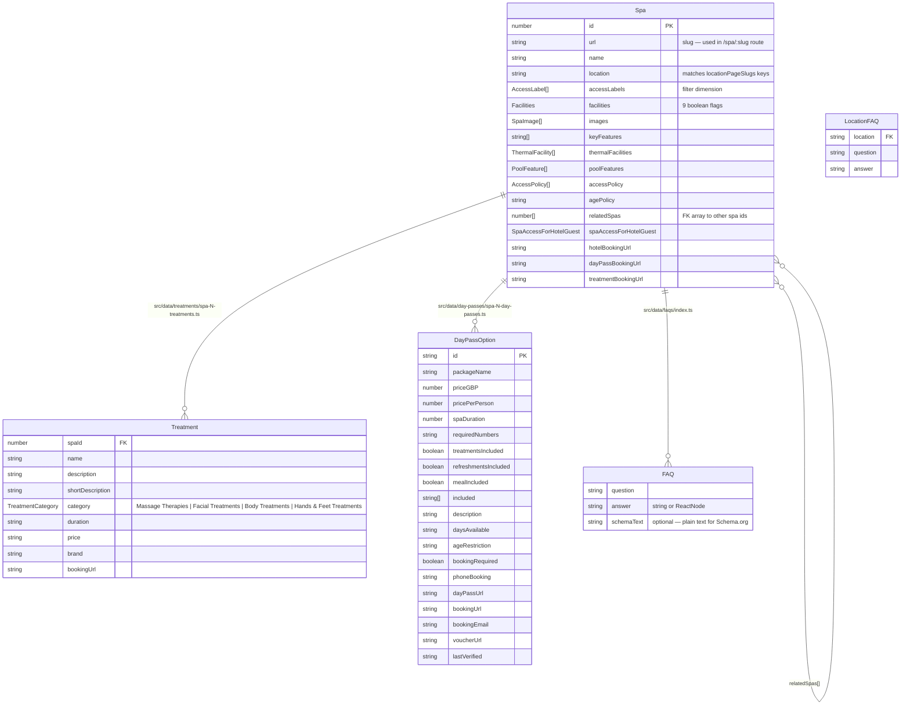

# Data Layer — Spa Entity Relationships

```mermaid
erDiagram
    Spa {
        number id PK
        string url "slug — used in /spa/:slug route"
        string name
        string location "matches locationPageSlugs keys"
        AccessLabel[] accessLabels "filter dimension"
        Facilities facilities "9 boolean flags"
        SpaImage[] images
        string[] keyFeatures
        ThermalFacility[] thermalFacilities
        PoolFeature[] poolFeatures
        AccessPolicy[] accessPolicy
        string agePolicy
        number[] relatedSpas "FK array to other spa ids"
        SpaAccessForHotelGuest spaAccessForHotelGuest
        string hotelBookingUrl
        string dayPassBookingUrl
        string treatmentBookingUrl
    }

    Treatment {
        number spaId FK
        string name
        string description
        string shortDescription
        TreatmentCategory category "Massage Therapies | Facial Treatments | Body Treatments | Hands & Feet Treatments"
        string duration
        string price
        string brand
        string bookingUrl
    }

    DayPassOption {
        string id PK
        string packageName
        number priceGBP
        number pricePerPerson
        number spaDuration
        string requiredNumbers
        boolean treatmentsIncluded
        boolean refreshmentsIncluded
        boolean mealIncluded
        string[] included
        string description
        string daysAvailable
        string ageRestriction
        boolean bookingRequired
        string phoneBooking
        string dayPassUrl
        string bookingUrl
        string bookingEmail
        string voucherUrl
        string lastVerified
    }

    FAQ {
        string question
        string answer "string or ReactNode"
        string schemaText "optional — plain text for Schema.org"
    }

    LocationFAQ {
        string location FK
        string question
        string answer
    }

    Spa ||--o{ Treatment : "src/data/treatments/spa-N-treatments.ts"
    Spa ||--o{ DayPassOption : "src/data/day-passes/spa-N-day-passes.ts"
    Spa ||--o{ FAQ : "src/data/faqs/index.ts"
    Spa }o--o{ Spa : "relatedSpas[]"
```

---
*Update this diagram when fields are added to `src/types/spa.ts`, or a new data collection is introduced. Treat as a living document.*
