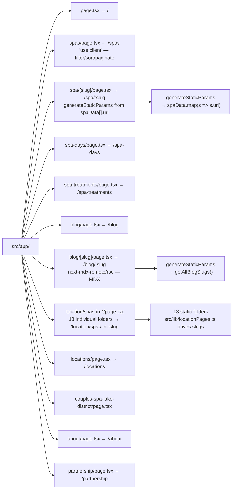

# App Router — URL Structure

```mermaid
graph LR
    root["src/app/"]

    root --> home["page.tsx → /"]
    root --> spas["spas/page.tsx → /spas\n'use client' — filter/sort/paginate"]
    root --> spa["spa/[slug]/page.tsx → /spa/:slug\ngenerateStaticParams from spaData[].url"]
    root --> spaDays["spa-days/page.tsx → /spa-days"]
    root --> spaTreat["spa-treatments/page.tsx → /spa-treatments"]
    root --> blog["blog/page.tsx → /blog"]
    root --> blogSlug["blog/[slug]/page.tsx → /blog/:slug\nnext-mdx-remote/rsc — MDX"]
    root --> locationSlug["location/spas-in-*/page.tsx\n13 individual folders → /location/spas-in-:slug"]
    root --> locations["locations/page.tsx → /locations"]
    root --> couples["couples-spa-lake-district/page.tsx"]
    root --> about["about/page.tsx → /about"]
    root --> partnership["partnership/page.tsx → /partnership"]

    spa --> staticNote["generateStaticParams\n→ spaData.map(s => s.url)"]
    blogSlug --> blogNote["generateStaticParams\n→ getAllBlogSlugs()"]
    locationSlug --> locationNote["13 static folders\nsrc/lib/locationPages.ts drives slugs"]
```

---
*Update this diagram when a new route is added, renamed, or restructured. Treat as a living document.*
