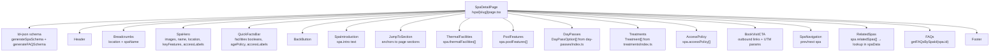

# Spa Detail Page — Component Tree

```mermaid
graph TD
    SpaDetailPage["SpaDetailPage\n/spa/[slug]/page.tsx"]

    SpaDetailPage --> schema["ld+json schema\ngenerateSpaSchema + generateFAQSchema"]
    SpaDetailPage --> Header
    SpaDetailPage --> Breadcrumbs["Breadcrumbs\nlocation + spaName"]
    SpaDetailPage --> SpaHero["SpaHero\nimages, name, location, keyFeatures, accessLabels"]
    SpaDetailPage --> QuickFactsBar["QuickFactsBar\nfacilities booleans, agePolicy, accessLabels"]
    SpaDetailPage --> BackButton
    SpaDetailPage --> SpaIntroduction["SpaIntroduction\nspa.intro text"]
    SpaDetailPage --> JumpToSection["JumpToSection\nanchors to page sections"]
    SpaDetailPage --> ThermalFacilities["ThermalFacilities\nspa.thermalFacilities[]"]
    SpaDetailPage --> PoolFeatures["PoolFeatures\nspa.poolFeatures[]"]
    SpaDetailPage --> DayPasses["DayPasses\nDayPassOption[] from day-passes/index.ts"]
    SpaDetailPage --> Treatments["Treatments\nTreatment[] from treatments/index.ts"]
    SpaDetailPage --> AccessPolicy["AccessPolicy\nspa.accessPolicy[]"]
    SpaDetailPage --> BookVisitCTA["BookVisitCTA\noutbound links + UTM params"]
    SpaDetailPage --> SpaNavigation["SpaNavigation\nprev/next spa"]
    SpaDetailPage --> RelatedSpas["RelatedSpas\nspa.relatedSpas[] → lookup in spaData"]
    SpaDetailPage --> FAQs["FAQs\ngetFAQsBySpaId(spa.id)"]
    SpaDetailPage --> Footer
```

---
*Update this diagram when components are added to or removed from the spa detail page. Treat as a living document.*
