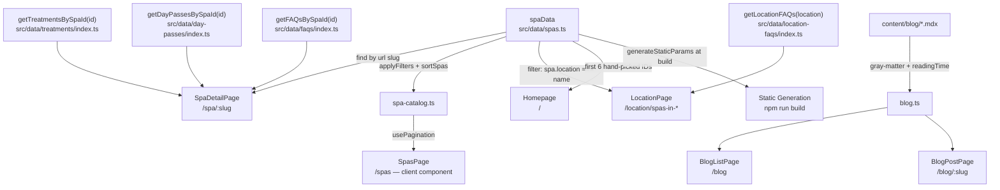

# Data Flow — Static TypeScript to Rendered Pages

```mermaid
flowchart TD
    spaData["spaData\nsrc/data/spas.ts"]
    treatIndex["getTreatmentsBySpaId(id)\nsrc/data/treatments/index.ts"]
    dayPassIndex["getDayPassesBySpaId(id)\nsrc/data/day-passes/index.ts"]
    faqIndex["getFAQsBySpaId(id)\nsrc/data/faqs/index.ts"]
    locationFaqIndex["getLocationFAQs(location)\nsrc/data/location-faqs/index.ts"]

    spaData --> |"find by url slug"| spaDetail["SpaDetailPage\n/spa/:slug"]
    treatIndex --> spaDetail
    dayPassIndex --> spaDetail
    faqIndex --> spaDetail

    spaData --> |"applyFilters + sortSpas"| spaCatalog["spa-catalog.ts"]
    spaCatalog --> |"usePagination"| spasPage["SpasPage\n/spas — client component"]

    spaData --> |"filter: spa.location === name"| locationPage["LocationPage\n/location/spas-in-*"]
    locationFaqIndex --> locationPage

    spaData --> |"first 6 hand-picked IDs"| homepage["Homepage\n/"]

    spaData --> |"generateStaticParams at build"| buildTime["Static Generation\nnpm run build"]

    blogMDX["content/blog/*.mdx"] --> |"gray-matter + readingTime"| blogLib["blog.ts"]
    blogLib --> blogList["BlogListPage\n/blog"]
    blogLib --> blogPost["BlogPostPage\n/blog/:slug"]
```

---
*Update this diagram when a new data source is wired to a page, or the static generation pattern changes. Treat as a living document.*
