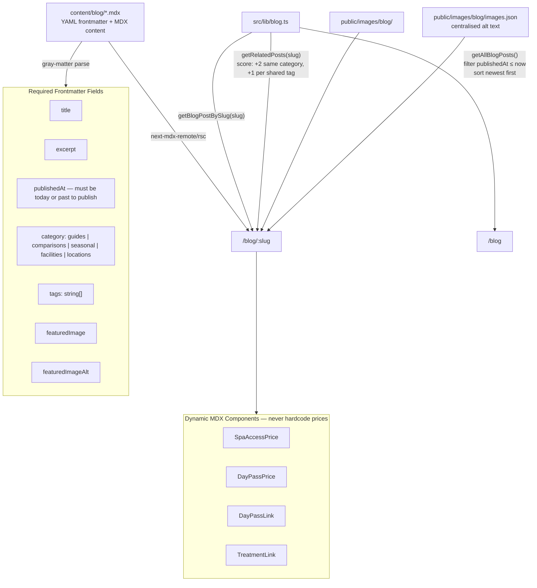

# Blog System — MDX Pipeline

```mermaid
flowchart TD
    mdxFiles["content/blog/*.mdx\nYAML frontmatter + MDX content"]

    subgraph Frontmatter["Required Frontmatter Fields"]
        title
        excerpt
        publishedAt["publishedAt — must be today or past to publish"]
        category["category: guides | comparisons | seasonal | facilities | locations"]
        tags["tags: string[]"]
        featuredImage
        featuredImageAlt
    end

    mdxFiles --> |"gray-matter parse"| Frontmatter
    mdxFiles --> |"next-mdx-remote/rsc"| BlogPostPage

    blogLib["src/lib/blog.ts"]
    blogLib --> |"getAllBlogPosts()\nfilter publishedAt ≤ now\nsort newest first"| BlogListPage["/blog"]
    blogLib --> |"getBlogPostBySlug(slug)"| BlogPostPage["/blog/:slug"]
    blogLib --> |"getRelatedPosts(slug)\nscore: +2 same category, +1 per shared tag"| BlogPostPage

    subgraph MDXComponents["Dynamic MDX Components — never hardcode prices"]
        SpaAccessPrice
        DayPassPrice
        DayPassLink
        TreatmentLink
    end

    BlogPostPage --> MDXComponents

    images["public/images/blog/"]
    imagesJson["public/images/blog/images.json\ncentralised alt text"]
    images --> BlogPostPage
    imagesJson --> BlogPostPage
```

---
*Update this diagram when new MDX components are added, frontmatter fields change, or blog utility functions are added. Treat as a living document.*
