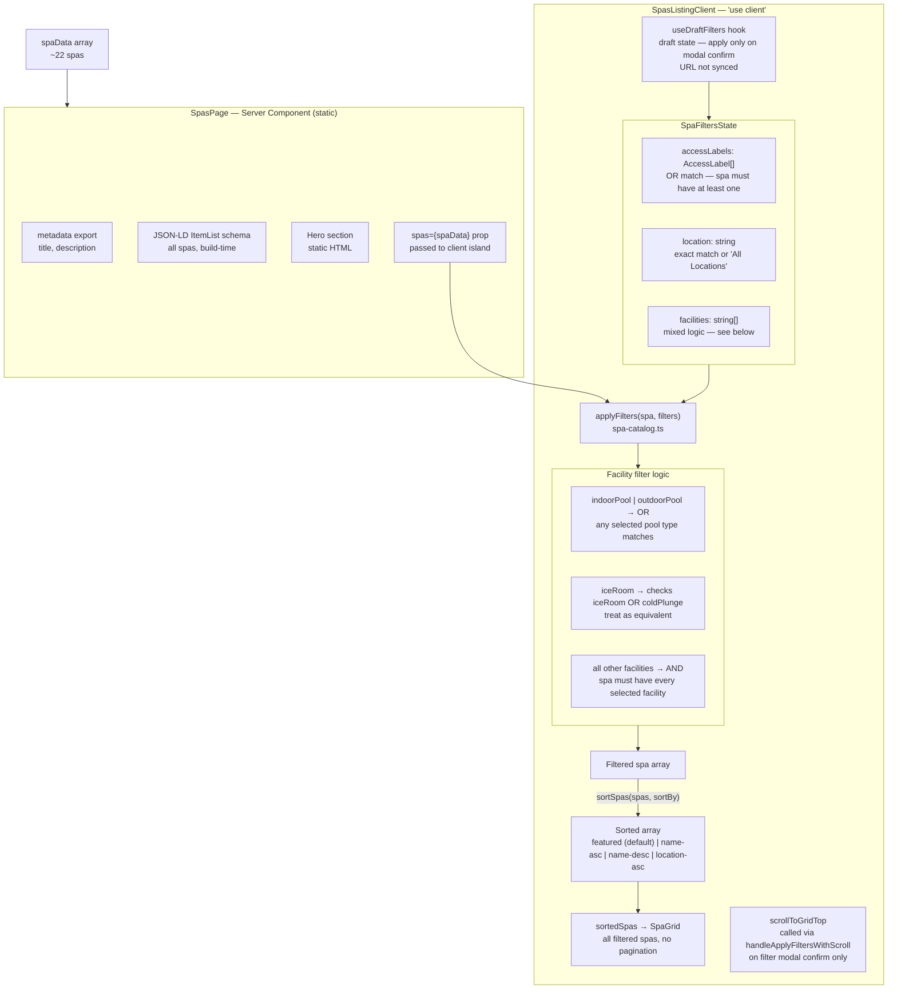

# Spas Page — Filter, Sort, and Rendering Flow

**featured sort:** returns the spas array in `spaData` declaration order — editorial order is controlled by repositioning entries in `src/data/spas.ts`.

**Static generation:** `SpasPage` has no dynamic functions (`cookies`, `headers`, `searchParams`) and no uncached fetches, so Next.js statically generates it at build time. `SpasListingClient` is SSR'd for the initial HTML, meaning all spa cards are present in the raw HTML source in their default (featured, unfiltered) state.

---
*Update this diagram when filter dimensions are added, filter logic changes, or the sort options change. Treat as a living document.*
