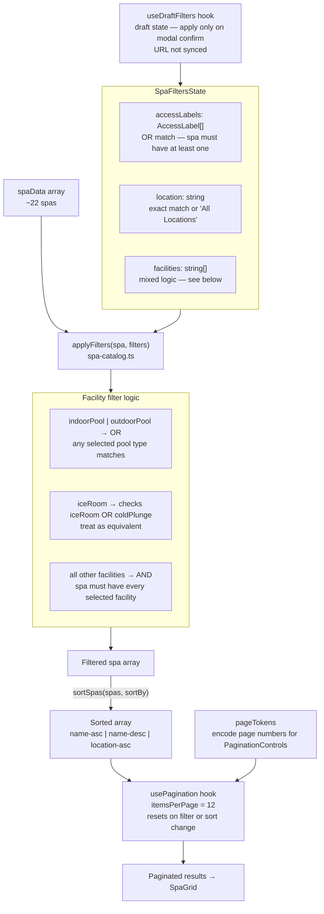

# Spas Page — Filter, Sort, and Pagination Flow

```mermaid
flowchart TD
    spaData["spaData array\n~22 spas"]

    subgraph FiltersState["SpaFiltersState"]
        accessLabels["accessLabels: AccessLabel[]\nOR match — spa must have at least one"]
        location["location: string\nexact match or 'All Locations'"]
        facilities["facilities: string[]\nmixed logic — see below"]
    end

    spaData --> applyFilters["applyFilters(spa, filters)\nspa-catalog.ts"]
    FiltersState --> applyFilters

    subgraph FacilityLogic["Facility filter logic"]
        poolOR["indoorPool | outdoorPool → OR\nany selected pool type matches"]
        iceSpecial["iceRoom → checks iceRoom OR coldPlunge\ntreat as equivalent"]
        otherAND["all other facilities → AND\nspa must have every selected facility"]
    end

    applyFilters --> FacilityLogic
    FacilityLogic --> filtered["Filtered spa array"]

    filtered --> |"sortSpas(spas, sortBy)"| sorted["Sorted array\nname-asc | name-desc | location-asc"]

    sorted --> usePagination["usePagination hook\nitemsPerPage = 12\nresets on filter or sort change"]
    usePagination --> paginatedSpas["Paginated results → SpaGrid"]

    useDraftFilters["useDraftFilters hook\ndraft state — apply only on modal confirm\nURL not synced"] --> FiltersState

    pageTokens["pageTokens\nencode page numbers for PaginationControls"] --> usePagination
```

---
*Update this diagram when filter dimensions are added, filter logic changes, or pagination behaviour changes. Treat as a living document.*
