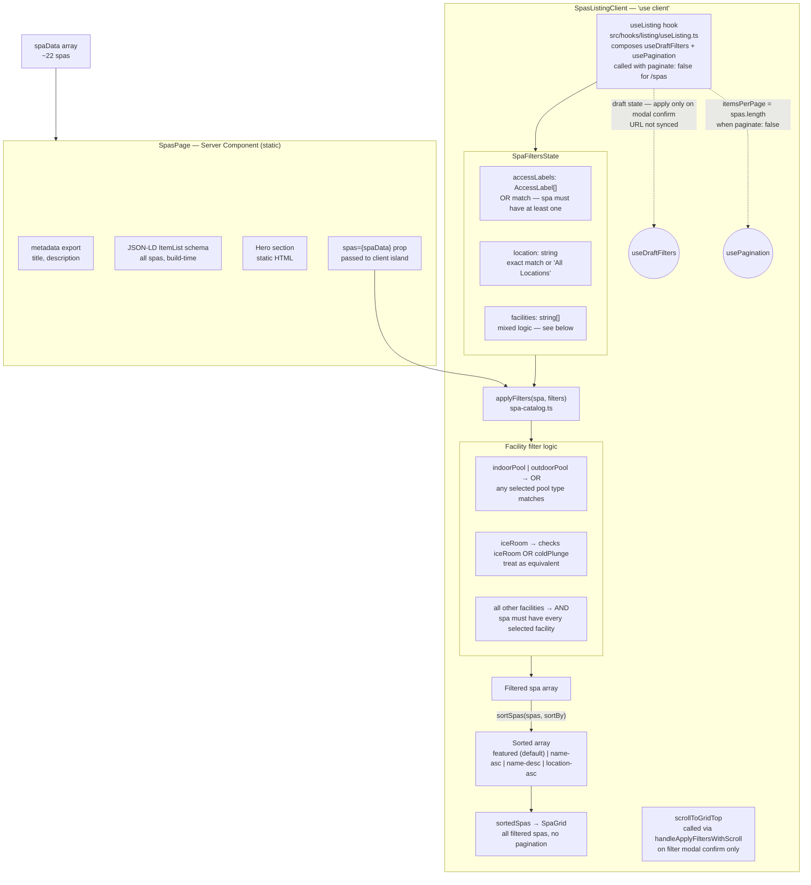

# Spas Page — Filter, Sort, and Rendering Flow

```mermaid
flowchart TD
    spaData["spaData array\n~22 spas"]

    subgraph ServerComponent["SpasPage — Server Component (static)"]
        metadata["metadata export\ntitle, description"]
        jsonld["JSON-LD ItemList schema\nall spas, build-time"]
        hero["Hero section\nstatic HTML"]
        props["spas={spaData} prop\npassed to client island"]
    end

    spaData --> ServerComponent

    subgraph ClientIsland["SpasListingClient — 'use client'"]
        subgraph FiltersState["SpaFiltersState"]
            accessLabels["accessLabels: AccessLabel[]\nOR match — spa must have at least one"]
            location["location: string\nexact match or 'All Locations'"]
            facilities["facilities: string[]\nmixed logic — see below"]
        end

        props --> applyFilters["applyFilters(spa, filters)\nspa-catalog.ts"]
        FiltersState --> applyFilters

        subgraph FacilityLogic["Facility filter logic"]
            poolOR["indoorPool | outdoorPool → OR\nany selected pool type matches"]
            iceSpecial["iceRoom → checks iceRoom OR coldPlunge\ntreat as equivalent"]
            otherAND["all other facilities → AND\nspa must have every selected facility"]
        end

        applyFilters --> FacilityLogic
        FacilityLogic --> filtered["Filtered spa array"]

        filtered --> |"sortSpas(spas, sortBy)"| sorted["Sorted array\nfeatured (default) | name-asc | name-desc | location-asc"]

        sorted --> SpaGrid["sortedSpas → SpaGrid\nall filtered spas, no pagination"]

        useListing["useListing hook\nsrc/hooks/listing/useListing.ts\ncomposes useDraftFilters + usePagination\ncalled with paginate: false for /spas"] --> FiltersState
        useListing -.-> |"draft state — apply only on modal confirm\nURL not synced"| useDraftFiltersNote(("useDraftFilters"))
        useListing -.-> |"itemsPerPage = spas.length\nwhen paginate: false"| usePaginationNote(("usePagination"))

        scroll["scrollToGridTop\ncalled via handleApplyFiltersWithScroll\non filter modal confirm only"]
    end
```

**featured sort:** returns the spas array in `spaData` declaration order — editorial order is controlled by repositioning entries in `src/data/spas.ts`.

**Static generation:** `SpasPage` has no dynamic functions (`cookies`, `headers`, `searchParams`) and no uncached fetches, so Next.js statically generates it at build time. `SpasListingClient` is SSR'd for the initial HTML, meaning all spa cards are present in the raw HTML source in their default (featured, unfiltered) state.

**Shared pipeline:** `useListing` is the same hook used by `/spa-days` and `/spa-treatments` (see below) — it composes `useDraftFilters` (filter state) + `usePagination` (paging) plus a memoized `filteredFn`/`sortFn` pipeline. `/spas` passes `paginate: false` explicitly (small dataset — ~22 spas, pagination would only add clicks); `/spa-days` and `/spa-treatments` paginate normally at 12 items/page.

---
*Update this diagram when filter dimensions are added, filter logic changes, or the sort options change. Treat as a living document.*
