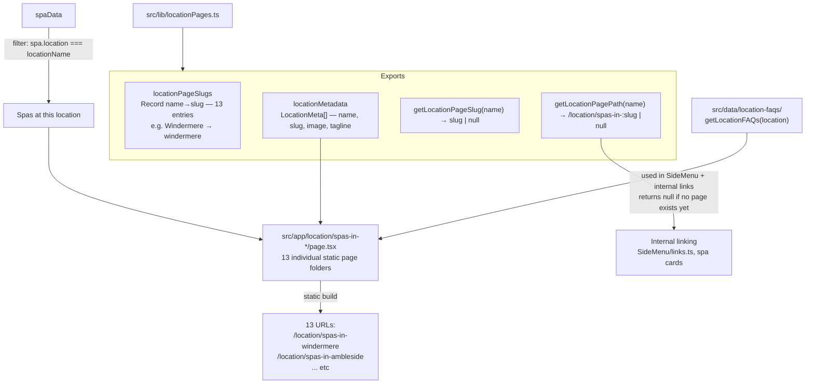

# Location Pages — Structure and Data Flow

---
*Update this diagram when a new location page is added (new entry in `locationPageSlugs`) or the location FAQ structure changes. Treat as a living document.*
