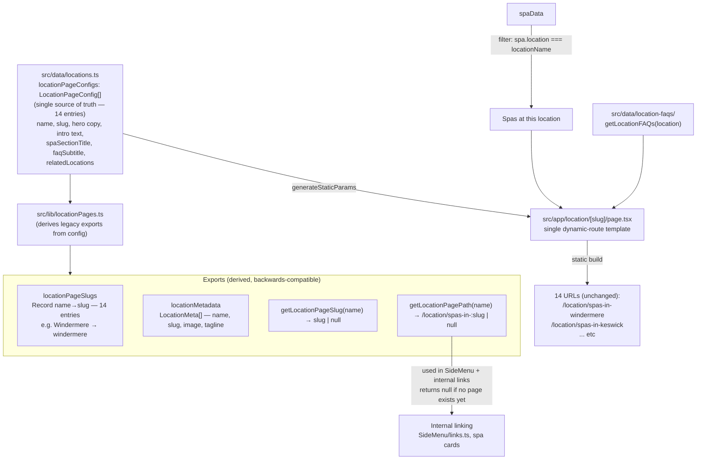

# Location Pages — Structure and Data Flow

```mermaid
flowchart TD
    configData["src/data/locations.ts\nlocationPageConfigs: LocationPageConfig[]\n(single source of truth — 14 entries)\nname, slug, hero copy, intro text,\nspaSectionTitle, faqSubtitle, relatedLocations"]

    locationLib["src/lib/locationPages.ts\n(derives legacy exports from config)"]

    subgraph Exports["Exports (derived, backwards-compatible)"]
        slugMap["locationPageSlugs\nRecord name→slug — 14 entries\ne.g. Windermere → windermere"]
        metadata["locationMetadata\nLocationMeta[] — name, slug, image, tagline"]
        getSlug["getLocationPageSlug(name) → slug | null"]
        getPath["getLocationPagePath(name) → /location/spas-in-:slug | null"]
    end

    configData --> locationLib --> Exports

    spaData["spaData"] --> |"filter: spa.location === locationName"| localSpas["Spas at this location"]

    configData --> |"generateStaticParams"| LocationPage["src/app/location/[slug]/page.tsx\nsingle dynamic-route template"]
    localSpas --> LocationPage
    locationFaqs["src/data/location-faqs/\ngetLocationFAQs(location)"] --> LocationPage

    LocationPage --> |"static build"| rendered["14 URLs (unchanged):\n/location/spas-in-windermere\n/location/spas-in-keswick\n... etc"]

    getPath --> |"used in SideMenu + internal links\nreturns null if no page exists yet"| internalLinks["Internal linking\nSideMenu/links.ts, spa cards"]
```

Adding a new location page now means adding one entry to `locationPageConfigs` in `src/data/locations.ts` — `locationPageSlugs`/`locationMetadata` and the routed page are all derived from it, so there's no second registry to remember (this is what caused Keswick to go missing from breadcrumbs/grids for a while despite having a working page).

---
*Update this diagram when a new location page is added (new entry in `locationPageConfigs`) or the location FAQ structure changes. Treat as a living document.*
